## GENAI

### Tiny Generative AI Framework
 GENAI is a tiny generative AI Framework.
### Setup / Installation
 To install GENAI


```python
import genai as ai
```


```python
modelgraph = ai.Model(dtype=ai.DataType.float32);
node1  = modelgraph.addNode("node1", ai.NodeType.Generic);
node2  = modelgraph.addNode("node2", ai.NodeType.Generic);
node3  = modelgraph.addNode("node3", ai.NodeType.Generic);
node4  = modelgraph.addNode("node4", ai.NodeType.Generic);
node5  = modelgraph.addNode("node5", ai.NodeType.Generic);
modelgraph.connect([node1, node2], node3);
modelgraph.connect(node3,[node4, node5]);
```


```python
from graphviz import Source
from IPython.display import display

dot_graph = modelgraph.generateDotFormat(operators=True, weights=True);
print(dot_graph);
source = Source(dot_graph, format='svg')
display(source)
```

    digraph G {  node [shape=circle, fontsize=11]; rankdir=LR; node1; node2; node3; node4; node5; node1->node3;node2->node3;node3->node4;node3->node5;node1_label [shape=record, fontsize=11, label=""]; node1->node1_label;node2_label [shape=record, fontsize=11, label=""]; node2->node2_label;node3_label [shape=record, fontsize=11, label=""]; node3->node3_label;node4_label [shape=record, fontsize=11, label=""]; node4->node4_label;node5_label [shape=record, fontsize=11, label=""]; node5->node5_label;}


    
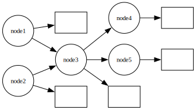
    


### SGD Regression Module from sklearn


```python
from sklearn.linear_model import SGDRegressor

# Create a SGDRegressor model with a specified number of iterations
model = SGDRegressor(max_iter=1000)

# Generate random data
np.random.seed(0)
x = np.random.rand(100, 1)  # Random x-values between 0 and 1
y = 2 * x + 1 + 0.1 * np.random.randn(100, 1)  # Linear relationship with noise

# Fit the model to your data, and make inference on same data.
reg = model.fit(x, y.ravel())
y_pred = reg.predict(x)

# Create a scatter plot of the random points
plt.scatter(x, y, s=3, label="Random Data")


# Plot the regression line
plt.plot(x, y_pred, color='darkgreen', linewidth=1,  label="Regression Line")

plt.grid(True)

# Add labels and legend
plt.xlabel("X")
plt.ylabel("Y")
plt.legend()

# Show the plot
plt.show()
```


    
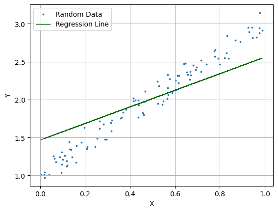
    


### Regression Module from sklearn


```python
import numpy as np
import matplotlib.pyplot as plt
from sklearn.linear_model import LinearRegression

# Generate random data
np.random.seed(0)
x = np.random.rand(100, 1)  # Random x-values between 0 and 1
y = 2 * x + 1 + 0.1 * np.random.randn(100, 1)  # Linear relationship with noise

# Perform linear regression and make inference on same data.
reg = LinearRegression().fit(x, y)
y_pred = reg.predict(x)

# Create a scatter plot of the random points
plt.scatter(x, y, s=3, label="Random Data")

# Plot the regression line
plt.plot(x, y_pred, color='darkgreen', linewidth=1,  label="Regression Line")

plt.grid(True)

# Add labels and legend
plt.xlabel("X")
plt.ylabel("Y")
plt.legend()

# Show the plot
plt.show()
```


    
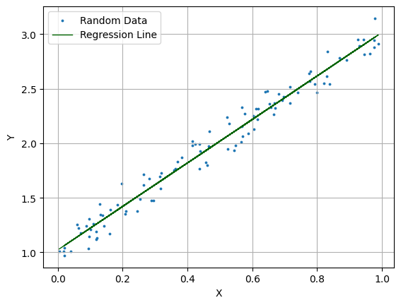
    


### Our own Regression module


```python
import genai as ai
import numpy as np
import matplotlib.pyplot as plt

x = np.random.rand(100, 1)  # Random x-values between 0 and 1
y = 2 * x + 1 + 0.1 * np.random.randn(100, 1)  # Linear relationship with noise

modelgraph = ai.Model(dtype=ai.DataType.float32);
root_node  = modelgraph.addNode("root_node", ai.NodeType.Generic);
root_node.setOperations([ ai.Dense(size=1, bias=True), ai.Activation(type="leakyrelu", alpha=0.01)]);

root_node.setData(data = np.array(x, dtype=np.float32), normalize=False);

# Set The target
modelgraph.setTarget(data = np.array(y, dtype=np.float32));

# Perform fitting
losses = modelgraph.train(loss="mse", metrics=[], optimizer="adam", learn_rate=0.1, max_epoch=120);
```

     Set Data in float32 format ... 
    Dim0: 1 Dim1: 100 Dim2: 1
    Dim0: 1 Dim1: 100 Dim2: 1
    Fitting the model ...
    Target Size 1
    Batch Size: 10 Target Size: 1
    Epoch 1/120 ... Loss: 4.51302 ... Avg Elapsed 41us at Mon Feb  3 23:06:00 2025
    
    Epoch 12/120 ... Loss: 0.88982 ... Avg Elapsed 10.5455us at Mon Feb  3 23:06:00 2025
    
    Epoch 24/120 ... Loss: 0.245038 ... Avg Elapsed 9.25us at Mon Feb  3 23:06:00 2025
    
    Epoch 36/120 ... Loss: 0.160063 ... Avg Elapsed 9.25us at Mon Feb  3 23:06:00 2025
    
    Epoch 48/120 ... Loss: 0.0726847 ... Avg Elapsed 9.08333us at Mon Feb  3 23:06:00 2025
    
    Epoch 60/120 ... Loss: 0.0430963 ... Avg Elapsed 9.08333us at Mon Feb  3 23:06:00 2025
    
    Epoch 72/120 ... Loss: 0.028848 ... Avg Elapsed 9.08333us at Mon Feb  3 23:06:00 2025
    
    Epoch 84/120 ... Loss: 0.0180636 ... Avg Elapsed 9.08333us at Mon Feb  3 23:06:00 2025
    
    Epoch 96/120 ... Loss: 0.0135839 ... Avg Elapsed 9.08333us at Mon Feb  3 23:06:00 2025
    
    Epoch 108/120 ... Loss: 0.0109683 ... Avg Elapsed 9.08333us at Mon Feb  3 23:06:00 2025
    
    Epoch 120/120 ... Loss: 0.00971427 ... Avg Elapsed 9.08333us at Mon Feb  3 23:06:00 2025
    
     Duration D: 0, HR: 0, MN: 0, SC: 0.001142


```python
import matplotlib.pylab as plt
plt.figure(1)
plt.title("Loss")
plt.plot(losses)
```


    [<matplotlib.lines.Line2D at 0x15d770710>]


    
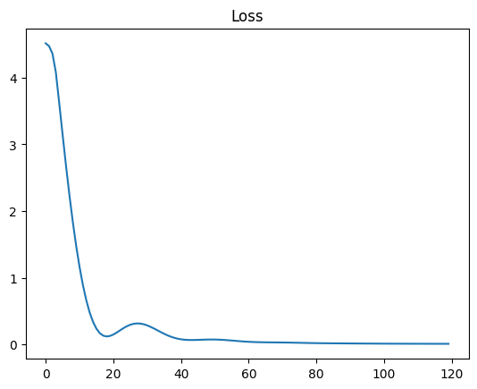
    


```python
# Perform Prediction
new_x = x; #np.random.rand(100, 1)  # Random x-values between 0 and 1
root_node.setData(data = np.array(new_x, dtype=np.float32), normalize=False);

yy_pred = modelgraph.predict(sequence_length=0 );
yyy_pred = yy_pred[0]
```

     Set Data in float32 format ... 
    Dim0: 1 Dim1: 100 Dim2: 1
    Entering Prediction Float ...Elapsed 11us at Mon Feb  3 13:27:04 2025
    


```python
# Plot the regression line
# Create a scatter plot of the random points
plt.scatter(x, y, s=3, label="Random Data")

plt.plot(x, yyy_pred, color='darkgreen', linewidth=1,  label="Regression Line")

plt.grid(True)

# Add labels and legend
plt.xlabel("X")
plt.ylabel("Y")
plt.legend()

# Show the plot
plt.show()
```


    
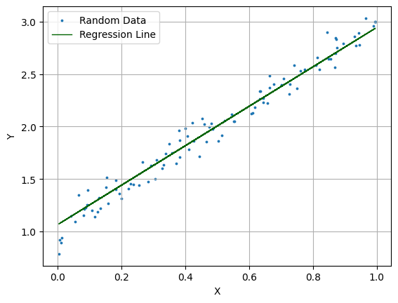
    


**Regression - using Mean Squared Error (MSE)**<br>


```python
modelgraph.train(loss="mse", metrics=[], optimizer="adam", learn_rate=0.1, max_epoch=120);
```

    Fitting the model ...
    Target Size 1
    Batch Size: 10 Target Size: 1
    Epoch 1/120 ... Loss: 0.00970247 ... Avg Elapsed 252us at Mon Feb  3 13:27:19 2025
    
    Epoch 12/120 ... Loss: 0.0094352 ... Avg Elapsed 10.6364us at Mon Feb  3 13:27:19 2025
    
    Epoch 24/120 ... Loss: 0.00928128 ... Avg Elapsed 9.41667us at Mon Feb  3 13:27:19 2025
    
    Epoch 36/120 ... Loss: 0.00916839 ... Avg Elapsed 9.25us at Mon Feb  3 13:27:19 2025
    
    Epoch 48/120 ... Loss: 0.00908192 ... Avg Elapsed 9.16667us at Mon Feb  3 13:27:19 2025
    
    Epoch 60/120 ... Loss: 0.00902039 ... Avg Elapsed 9.16667us at Mon Feb  3 13:27:19 2025
    
    Epoch 72/120 ... Loss: 0.00897979 ... Avg Elapsed 9.33333us at Mon Feb  3 13:27:19 2025
    
    Epoch 84/120 ... Loss: 0.00895513 ... Avg Elapsed 9.25us at Mon Feb  3 13:27:19 2025
    
    Epoch 96/120 ... Loss: 0.00894137 ... Avg Elapsed 9.16667us at Mon Feb  3 13:27:19 2025
    
    Epoch 108/120 ... Loss: 0.00893433 ... Avg Elapsed 9.08333us at Mon Feb  3 13:27:19 2025
    
    Epoch 120/120 ... Loss: 0.00893102 ... Avg Elapsed 9.16667us at Mon Feb  3 13:27:19 2025
    
     Duration D: 0, HR: 0, MN: 0, SC: 0.001365


## **Non Linearity:**<br>
 Logistic Regression - using Sigmoid
 SoftMax - to support Probability outcomes as an example


```python
activation = 'softmax'
activation = 'sigmoid'
activation = 'leakyrelu'
```

**Classification - using Binary Cross-Entropy (BCE) or Categorical Cross-Entropy (CCE)**<br>


```python
modelgraph.train(loss="bce", metrics=[], optimizer="adam", learn_rate=0.01, max_epoch=1);
modelgraph.train(loss="cce", metrics=[], optimizer="adam", learn_rate=0.01, max_epoch=1);
```

    Fitting the model ...
    Target Size 5
    Batch Size: 10 Target Size: 5
    Epoch 1/1 ... Loss: 0.00174062 ... Avg Elapsed 865us at Tue Feb  4 07:43:51 2025
    
     Duration D: 0, HR: 0, MN: 0, SC: 0.000865
    Fitting the model ...
    Target Size 5
    Batch Size: 10 Target Size: 5
    Epoch 1/1 ... Loss: 0.00525899 ... Avg Elapsed 137us at Tue Feb  4 07:43:51 2025
    
     Duration D: 0, HR: 0, MN: 0, SC: 0.000137


### Optimizer
### Tokenizer
<p>Tokenization includes BPE and GloVe <a href="https://nlp.stanford.edu/pubs/glove.pdf">(GloVe: Global Vectors for Word Representation)</a></p>
<p>Here, we show how to build a vocabulary containing tokenized words and sub-words using BPE (Byte-Pair Encoding). From there, we use GloVe to generate embeddings per token.</p>
<p>Depending on the training, our goal is to generate some level of context to each token based on probability of co-occurrence with other tokens limited to the available corpus provided during training. Thus, our embeddings (depending on the dimension chosen) are best-effort comparison of the semantics of a 'cat' compared to a 'dog' as an example in the context of them belonging to the token 'pets'</p>

### Using spacy - a free open-source library for Natural Language Processing
  Create clean_sentence function


```python
import numpy as np
import spacy

# Load spaCy English language model
nlp = spacy.load('en_core_web_sm')

# Function to clean a single sentence
def clean_sentence(sentence):
    doc = nlp(sentence)
    cleaned_tokens = [token.text.lower() for token in doc if token.text != '.']
    return ' '.join(cleaned_tokens)
```

### Cleansing Sentence list using nltk (Natural Language ToolKit)


```python
import nltk
nltk.download('punkt')
nltk.download('punkt_tab')
print(nltk.data.find('tokenizers/punkt'))
```

    /Users/raymondordona/nltk_data/tokenizers/punkt


    [nltk_data] Downloading package punkt to
    [nltk_data]     /Users/raymondordona/nltk_data...
    [nltk_data]   Package punkt is already up-to-date!
    [nltk_data] Downloading package punkt_tab to
    [nltk_data]     /Users/raymondordona/nltk_data...
    [nltk_data]   Package punkt_tab is already up-to-date!


```python
# Test that nltk is working
from nltk.tokenize import word_tokenize
print(word_tokenize("Hello, how are you?"))
```

    ['Hello', ',', 'how', 'are', 'you', '?']


```python
import nltk
from nltk import sent_tokenize, word_tokenize
import string

# Open the text file for reading
with open('/Users/raymondordona/Workspace/genaiproj/dataset/king_queen_english.txt', 'r') as file:
    text = file.read()

# Tokenize the text into sentences
sentences = sent_tokenize(text)

sentences

# Clean each sentence in the list
cleaned_sentences = [clean_sentence(sentence) for sentence in sentences]
cleaned_sentences
```


    ['the king and queen attended the royal banquet together',
     'a wise man once said , " every queen deserves a king "',
     'the man and woman strolled through the palace gardens',
     'queen elizabeth greeted the man and woman warmly',
     'the king and queen ruled the kingdom with grace',
     'a strong man protects his queen with unwavering loyalty',
     "the woman admired the queen 's elegant gown",
     'every king needs a queen by his side',
     'the wise man advised the young queen on matters of the state',
     'the queen and king exchanged vows in a grand ceremony',
     'a noble woman should be treated like a queen',
     'the king and queen dined in the royal chamber',
     'the man and woman shared a dance at the grand ball',
     "the queen and king 's love story captivated the kingdom",
     'a woman of great wisdom can be a queen in her own right',
     'the king and queen gazed at the stars from the palace balcony',
     'the wise man counseled the queen on diplomacy',
     "a woman 's strength can complement a man 's courage",
     'the queen and king led their troops into battle',
     'the man and woman enjoyed a peaceful afternoon in the courtyard',
     "a queen 's kindness is revered by her people",
     'the wise man and noble woman discussed matters of governance',
     "the king and queen 's love was celebrated throughout the land",
     "a man 's devotion to his queen is the foundation of a strong kingdom",
     "the woman admired the queen 's regal demeanor",
     'the king and queen hosted a grand celebration for the kingdom',
     'a wise man once said , " a queen \'s wisdom surpasses that of kings "',
     "the queen and king 's coronation was a spectacle of grandeur",
     'the man and woman explored the vast castle together',
     'queen victoria was known as a trailblazing woman of her time',
     "the king and queen 's portrait hung proudly in the palace",
     'a compassionate man values the happiness of his queen',
     'the woman aspired to embody the grace of a queen',
     'the wise man shared his knowledge with the young queen',
     "the king and queen 's legacy endured for generations",
     'a loving man supports his queen in times of need',
     'the queen and king welcomed visitors from distant lands',
     "the man and woman admired the queen 's charitable endeavors",
     "the queen and king 's love story inspired many",
     'a resilient woman can be a queen in adversity',
     'the king and queen bestowed honors upon their loyal subjects',
     "a just man ensures fairness in the queen 's court",
     "the woman observed the queen 's regal presence",
     'the wise man and noble woman governed the kingdom wisely',
     "the king and queen 's thrones stood side by side",
     'a devoted man cherishes the happiness of his queen',
     "the queen and king 's portraits adorned the castle walls",
     'the man and woman reveled in the splendor of the royal gardens',
     'a wise man once said , " a queen \'s strength lies in her compassion "',
     'the queen and king celebrated their golden jubilee with great festivity']


### Let's train a model using the list of sentences above.


```python
import genai as ai

random_seed  = 2024
tokenizer = ai.TokenModel(tokenizer="bpetokenizer", dtype=ai.DataType.float32, seed = random_seed);

# Size is the dimensionality of each token generated. Length of an embedding (Vector)
tokenizer.preload(corpus = cleaned_sentences, merges = 50, size=60);
tokenizer.train(corpus=cleaned_sentences, 
                batch_size=2, 
                losstype = "mse", 
                optimizertype = "adagrad", 
                learn_rate = 0.01, 
                max_epoch = 1000, 
                clipthreshold = 5.0, 
                regularization = 1.0);
```

    Current Directory: /Users/raymondordona/Workspace/genaiproj/notebook
    Epoch 1/1000 ... Loss: 0.250628 ... elapsed 3425us at Tue Feb  4 14:59:18 2025
    
    Epoch 100/1000 ... Loss: 0.0164556 ... elapsed 3552.83us at Tue Feb  4 14:59:18 2025
    
    Epoch 200/1000 ... Loss: 0.00509316 ... elapsed 3570.35us at Tue Feb  4 14:59:19 2025
    
    Epoch 300/1000 ... Loss: 0.00163649 ... elapsed 3649.74us at Tue Feb  4 14:59:19 2025
    
    Epoch 400/1000 ... Loss: 0.000668773 ... elapsed 3770.06us at Tue Feb  4 14:59:20 2025
    
    Epoch 500/1000 ... Loss: 0.000329785 ... elapsed 3740.66us at Tue Feb  4 14:59:20 2025
    
    Epoch 600/1000 ... Loss: 0.000196039 ... elapsed 3571.98us at Tue Feb  4 14:59:20 2025
    
    Epoch 700/1000 ... Loss: 0.00013305 ... elapsed 3567.08us at Tue Feb  4 14:59:21 2025
    
    Epoch 800/1000 ... Loss: 9.70264e-05 ... elapsed 3620.1us at Tue Feb  4 14:59:21 2025
    
    Epoch 900/1000 ... Loss: 7.28846e-05 ... elapsed 3544.77us at Tue Feb  4 14:59:21 2025
    
    Epoch 1000/1000 ... Loss: 5.49808e-05 ... elapsed 3644.78us at Tue Feb  4 14:59:22 2025
    


### List tokens generated from the training.


```python
tokens = tokenizer.tokens()
for i, token in enumerate(tokens):
    if token == "king" or token == "queen" or  token == "man" or token == "woman" or token == "love" or token == "story":
        print(i, token)
```

    43 man
    72 king
    94 queen
    126 love
    127 story
    146 woman


### List the embeddings generated from the training.


```python
embeddings = tokenizer.embeddings()
rows, cols = embeddings.shape
# Print dimensions
print("Number of rows (Tokens):", rows)
print("Number of columns (Dimensionality of each Token):", cols)
print(embeddings)
```

    Number of rows (Tokens): 178
    Number of columns (Dimensionality of each Token): 60
    [[-0.12535957  0.04786213 -0.06481006 ...  0.13772975  0.0115769
      -0.14293019]
     [ 0.11950527 -0.12238924  0.01020201 ... -0.0031306  -0.09407393
       0.00479874]
     [-0.14464042  0.1538621  -0.08940978 ... -0.11268584 -0.03379217
      -0.17281213]
     ...
     [ 0.75979239 -0.38139877  0.4180665  ...  0.26501417 -0.05181561
      -0.04552202]
     [-0.24126709  0.19461352  0.13834456 ... -0.03284261 -0.01094701
       0.08535377]
     [ 0.20858303  0.19098526  0.22632205 ... -0.19686729  0.16357453
       0.03520745]]


### Finally, let's plot similar words (compute similarity and graph via T-SNE)
  t-SNE -  a great tool to understand high-dimensional datasets.


```python
import numpy as np
from sklearn.manifold import TSNE
import matplotlib.pyplot as plt

# Perform t-SNE
tsne = TSNE(n_components=2, random_state=42)
embedded_pcas = tsne.fit_transform(embeddings)

# Scatter plot the embedded tokens
plt.scatter(embedded_pcas[:, 0], embedded_pcas[:, 1])

# Annotate points with token labels (optional)
for i, token in enumerate(tokens):
    if token == "king" or token == "queen" or token == "noble" or token == "wise" or token == "man" or token == "woman" or token == "love" or token == "story":
        plt.annotate(token, (embedded_pcas[i, 0], embedded_pcas[i, 1]))

# Show the plot
plt.show()
```

    /usr/local/lib/python3.11/site-packages/threadpoolctl.py:1214: RuntimeWarning: 
    Found Intel OpenMP ('libiomp') and LLVM OpenMP ('libomp') loaded at
    the same time. Both libraries are known to be incompatible and this
    can cause random crashes or deadlocks on Linux when loaded in the
    same Python program.
    Using threadpoolctl may cause crashes or deadlocks. For more
    information and possible workarounds, please see
        https://github.com/joblib/threadpoolctl/blob/master/multiple_openmp.md
    
      warnings.warn(msg, RuntimeWarning)


    
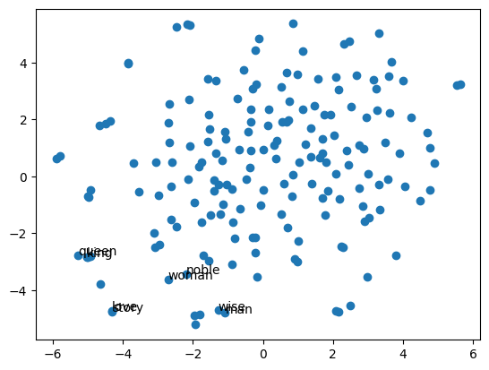
    


## Let's try to do some sequencing


```python
# Fifty Sentences
#sequences = tokenizer.encode(corpus = cleaned_sentences[:2], sequence_type = "chunk", rowwise = True)
tokenizer.encode(corpus = cleaned_sentences, sample_size = 2000, chunk_size = 8, sequence_type = "chunk", rowwise = True)
input_seq = tokenizer.getInputSequence();
shifted_seq = tokenizer.getShiftedSequence();
target_seq = tokenizer.getTargetSequence();

print(input_seq.shape);
print(shifted_seq.shape);
print(target_seq.shape);
print("For the Input Sequence: Number of Sampled Chunks:", input_seq.shape[0],
      ",Size of Each Chunk:", input_seq.shape[1],
      ",Dimensionality of each Chunk:", input_seq.shape[2])
print("For the Target Sequence: Number of Sampled Chunks:", target_seq.shape[0],
      ",Size of Each Chunk:", target_seq.shape[1],

      ",Dimensionality of each Chunk:", target_seq.shape[2])
```

    (2000, 8, 60)
    (2000, 8, 60)
    (2000, 8, 1)
    For the Input Sequence: Number of Sampled Chunks: 2000 ,Size of Each Chunk: 8 ,Dimensionality of each Chunk: 60
    For the Target Sequence: Number of Sampled Chunks: 2000 ,Size of Each Chunk: 8 ,Dimensionality of each Chunk: 1


```python
input_list = tokenizer.decode(sequences = input_seq )
# print first 10 input sequences
for item in input_list[:10]:
    print(item)
```

     a grand celebration for the kingdom <EOS> a
     treated like a queen <EOS> the king and
     the king and queen 's portrait hung proudly
     in her own right <EOS> the king and
     happiness of his queen <EOS> the queen and
     woman shared a dance at the grand ball
     woman can be a queen in adversity <EOS>
     wise man once said , " every queen
     values the happiness of his queen <EOS> the
     the wise man advised the young queen on


```python
shift_list = tokenizer.decode(sequences = shifted_seq );
# print first 10 shifted sequences
for item in shift_list[:10]:
    print(item)
```

     <EOS> a grand celebration for the kingdom <EOS>
     <EOS> treated like a queen <EOS> the king
     <EOS> the king and queen 's portrait hung
     <EOS> in her own right <EOS> the king
     <EOS> happiness of his queen <EOS> the queen
     <EOS> woman shared a dance at the grand
     <EOS> woman can be a queen in adversity
     <EOS> wise man once said , " every
     <EOS> values the happiness of his queen <EOS>
     <EOS> the wise man advised the young queen


```python
target_list = tokenizer.decode(sequences = target_seq, seq_type = "index" );
# print first 10 target sequences
for item in target_list[:10]:
    print(item)
```

     a grand celebration for the kingdom <EOS> a
     treated like a queen <EOS> the king and
     the king and queen 's portrait hung proudly
     in her own right <EOS> the king and
     happiness of his queen <EOS> the queen and
     woman shared a dance at the grand ball
     woman can be a queen in adversity <EOS>
     wise man once said , " every queen
     values the happiness of his queen <EOS> the
     the wise man advised the young queen on


```python
print(input_seq.shape)
input_seq[0][:1]
```

    (2000, 8, 60)


    array([[-0.8716712 ,  0.4592514 ,  0.30549002, -0.30970114,  0.8103225 ,
             0.31371456,  0.31360978, -0.56671005,  0.6587268 , -0.0493149 ,
            -0.06867412,  0.35648876,  1.1013229 , -0.7136581 , -0.5912185 ,
             0.28908223,  0.5347668 ,  0.43598834,  0.84614134, -0.60980237,
             0.573143  ,  0.2557695 , -0.57972634, -0.7237606 , -0.9167588 ,
             0.5816545 , -0.42934954, -0.652281  ,  0.59841686,  0.30987793,
             1.0772367 ,  0.37141293,  0.38205087,  0.25653243, -0.77572   ,
            -0.94899356, -0.04148953, -0.12743914, -0.5811286 , -0.6436127 ,
            -0.17764355, -0.2238144 , -0.41149414,  0.03409255, -0.11917447,
             0.7273307 , -0.15879674, -0.44476557,  0.36815107,  0.20489183,
            -0.05648833, -0.36795515, -0.5278955 , -0.6213527 , -0.49446136,
            -0.04972352,  0.0712999 ,  0.12285353, -0.32917482,  0.695412  ]],
          dtype=float32)


## Let's train a model using Encoder and Decoder


```python
modelgraph = ai.Model(dtype=ai.DataType.float32, seed = random_seed);
node1  = modelgraph.addNode("node1", ai.NodeType.Generic);
node2  = modelgraph.addNode("node2", ai.NodeType.Generic);


# Note that attention_size typically follows the embedding size which is dmodel, but 
# for flexibility, it can be explicitly set.
node1.setOperations([ai.Encoder(heads=2, attention_size=10, feed_size=10, layers=2, bias=True, activation_type="leakyrelu",  alpha=0.01 ),
                      # ai.Decoder(heads=10,   attention_size=40, feed_size=40, layers=2, bias=True, activation_type="leakyrelu",  alpha=0.01 ),
                      # ai.Attention(attention_size=60, bias = True, masked = True),
                      # ai.Dense(size=178, bias=True), ai.Activation(type="leakyrelu"),
                    ]
                 );

node2.setOperations([
                     ai.Decoder(heads=2,  attention_size=10, feed_size=10, layers=2, bias=True, activation_type="leakyrelu",  alpha=0.01 ),
                     #ai.Dense(size=178, bias=True), ai.Activation(type="leakyrelu"),
                      ai.Dense(size=178, bias=True), ai.Activation(type="softmax")
                    ]
                 );

modelgraph.connect(node1, node2);

encoder_input = np.array(input_seq[:1], dtype= np.float32);

# Here we perform teacher-forcing training in which we shift the input sequence and feed the shifted sequence into the decoder
decoder_input = np.array(shifted_seq[:1], dtype= np.float32);  # shifted

target  = np.array(target_seq[:1], dtype= np.float32); # tgt_sequences # Assume for now that the target is the same as input with decoder as shifted input.

# Set the Data. Normalize if required. Apply Positional Encoding if required
node1.setData(data = encoder_input, normalize=True, positional=True);

# If using Decoder in isolation (No Encoder)
#node1.setEncoderData(data = encoder_input, normalize=True, positional=True);
#node1.setDecoderData(data = decoder_input, normalize=True, positional=True);

# If using with Encoder
# Set the Decoder Data. Normalize if required. Apply Positional Encoding if required
node2.setDecoderData(data = decoder_input, normalize=True, positional=True);

# Set The target. If one-hot encoding or indices, then do not normalize
modelgraph.setTarget(data = target, normalize=False);

# Perform fitting
loss = modelgraph.train(loss="cce", metrics=[], optimizer="adam", batch_size = 50, max_epoch=1000, learn_rate=0.0001, use_step_decay = False, decay_rate = 0.90)
```

     Set Decoder Data in float32 format ... 
    Fitting the model ...
    Target Size 1
    Batch Size: 50 Target Size: 1
    Epoch 1/1000 ... Loss: 5.36118 ... Avg Elapsed 1236us at Tue Feb  4 16:37:03 2025
    
    Epoch 100/1000 ... Loss: 3.45718 ... Avg Elapsed 633.354us at Tue Feb  4 16:37:03 2025
    
    Epoch 200/1000 ... Loss: 1.99115 ... Avg Elapsed 615.89us at Tue Feb  4 16:37:03 2025
    
    Epoch 300/1000 ... Loss: 1.01996 ... Avg Elapsed 560.47us at Tue Feb  4 16:37:03 2025
    
    Epoch 400/1000 ... Loss: 0.630144 ... Avg Elapsed 565.69us at Tue Feb  4 16:37:03 2025
    
    Epoch 500/1000 ... Loss: 0.472009 ... Avg Elapsed 618.49us at Tue Feb  4 16:37:03 2025
    
    Epoch 600/1000 ... Loss: 0.396896 ... Avg Elapsed 561.17us at Tue Feb  4 16:37:03 2025
    
    Epoch 700/1000 ... Loss: 0.350535 ... Avg Elapsed 566.63us at Tue Feb  4 16:37:03 2025
    
    Epoch 800/1000 ... Loss: 0.315847 ... Avg Elapsed 549.28us at Tue Feb  4 16:37:03 2025
    
    Epoch 900/1000 ... Loss: 0.288035 ... Avg Elapsed 691.57us at Tue Feb  4 16:37:03 2025
    
    Epoch 1000/1000 ... Loss: 0.265263 ... Avg Elapsed 872.45us at Tue Feb  4 16:37:03 2025
    
     Duration D: 0, HR: 0, MN: 0, SC: 0.624102


```python
import matplotlib.pylab as plt
plt.figure(1)
plt.title("Loss")
plt.plot(loss)
```


    [<matplotlib.lines.Line2D at 0x161a2b250>]


    
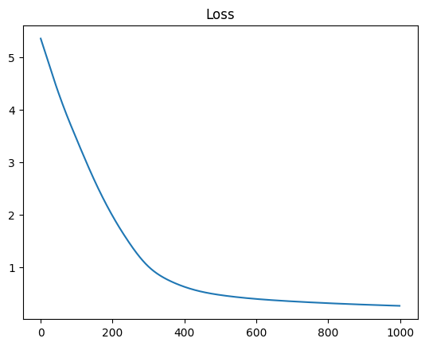
    


## Let's predict next sequences
 - Use an existing list of sentences, extract one of them and pretend it's new sentence.
 - The target should converge to the same sentence since it's already been trained.


```python
#new_sequences = tokenizer.encode(corpus = cleaned_sentences, sample_size = 2, chunk_size = 16, sequence_type = "chunk", rowwise = True)
#new_input_seq = tokenizer.getInputSequence();
#new_shifted_seq = tokenizer.getShiftedSequence();
#new_target_seq = tokenizer.getTargetSequence();
new_input_sequences = encoder_input; #np.array(input_seq[0], dtype=np.float32);
new_shifted_sequences = decoder_input #np.array(shifted_seq[0], dtype=np.float32);
p = tokenizer.decode(sequences = new_input_sequences);
p
```


    [' a grand celebration for the kingdom <EOS> a']


```python
# Perform Prediction
# new_x = ; #np.random.rand(100, 1)  # Random x-values between 0 and 1
node1.setData(data = new_input_sequences, normalize=True); 
node1.setEncoderData(data = new_input_sequences, normalize=True, positional=True);
node2.setDecoderData(data = new_shifted_sequences, normalize=True, positional=True);

yy_pred = modelgraph.predict(sequence_length = 20);
print(yy_pred.shape);
```

     Set Encoder Data in float32 format ... 
     Set Decoder Data in float32 format ... 
    Entering Prediction Float ... ... Elapsed 3007us at Tue Feb  4 16:40:00 2025
    
    (1, 8, 178)


```python
print("predicted sequence:")
p = tokenizer.decode(sequences = yy_pred, seq_type = "predicted");
p
```

    predicted sequence:


    [' a grand celebration for the kingdom <EOS> a']


# Recurrent Neural Network
## RNN, LSTM, GRU


```python
import genai as ai
import numpy as np

#class MyModel(ai.Model):
#
#   def __init__(self, learningRate, datatype):
#     super().__init__(learningRate, datatype);

sample = ai.SampleClass(0.01);

dtype = "float"
modelgraph = ai.Model(dtype=ai.DataType.float32);

node1  = modelgraph.addNode("node1", ai.NodeType.Input);

# MANY_TO_MANY
#node1.setOperations([ai.RNN(hidden_size=6, output_size=4,  num_layers=1, bidirectional=True, rnntype=ai.RNNtype.MANY_TO_MANY), ai.Activation(type="gelu", alpha=0.01)]);
node1.setOperations([ai.LSTM(hidden_size=6, output_size=5, num_layers=1, bidirectional=True, rnntype=ai.RNNtype.MANY_TO_MANY), ai.Activation(type="leakyrelu", alpha=0.01)]);
#node1.setOperations([ai.GRU(hidden_size=6, output_size=5, num_layers=1, bidirectional=True, rnntype=ai.RNNtype.MANY_TO_MANY), ai.Activation(type="leakyrelu", alpha=0.01)]);

# ONE_TO_MANY
#node1.setOperations([ai.RNN(hidden_size=6, output_size=5, output_sequence_length=3, num_layers=1, bidirectional=False, rnntype=ai.RNNtype.ONE_TO_MANY), ai.Activation(type="leakyrelu", alpha=0.01)]);
#node1.setOperations([ai.LSTM(hidden_size=6, output_size=5, output_sequence_length=3, num_layers=1, bidirectional=False, rnntype=ai.RNNtype.ONE_TO_MANY), ai.Activation(type="leakyrelu", alpha=0.01)]);
#node1.setOperations([ai.GRU(hidden_size=6, output_size=5, output_sequence_length=3, num_layers=1, bidirectional=False, rnntype=ai.RNNtype.ONE_TO_MANY), ai.Activation(type="leakyrelu", alpha=0.01)]);

node2  = modelgraph.addNode("node2", ai.NodeType.Input);
node2.setOperations([ai.Dense(size=4, bias=True), ai.Activation(type="softmax", alpha=0.01)])
#node2.setOperations([ai.Decoder(heads=2,  attention_size=6, feed_size=4, layers=1,  bias=True, activation_type="leakyrelu", alpha=0.01), 
#                     ai.Dense(size=4, bias=True), ai.Activation(type="leakyrelu", alpha=0.01)]);

embedding1 = [
               [  [1.11,1.12,1.13,1.14],  [1.21,1.22,1.23,1.24], [1.31,1.32,1.33,1.34]  ], # sequence 1 of batch 1,2,3
               [  [2.11,2.12,2.13,2.14],  [2.21,2.22,2.23,2.24], [2.31,2.32,2.33,2.34]  ], # sequence 2 of batch 1,2,3
               [  [3.11,3.12,3.13,3.14],  [3.21,3.22,3.23,3.24], [3.31,3.32,3.33,3.34]  ], # sequence 3 of batch 1,2,3
               [  [4.11,4.12,4.13,4.14],  [4.21,4.22,4.23,3.24], [4.31,4.32,4.33,5.34]  ], # sequence 4 of batch 1,2,3
               [  [5.11,5.12,5.13,5.14],  [5.21,5.22,5.23,3.24], [5.31,5.32,5.33,5.34]  ]  # sequence 5 of batch 1,2,3
             ];

node1.setData(data = np.array(embedding1, dtype=np.float32), normalize=False);

modelgraph.connect(node1, node2);

# Ground Truth in which
target = [ 
           [  [0,0,1,0],  [0,0,1,0], [0,0,1,0]  ], # Any data that has close to 1, has a probably of [0,0,1,0] 
           [  [1,0,0,0],  [1,0,0,0], [1,0,0,0]  ], # Any data that has close to 2, has a probably of [1,0,0,0]
           [  [0,0,0,1],  [0,0,0,1], [0,0,0,1]  ], # Any data that has close to 3, has a probably of [0,0,0,1]
           [  [1,0,0,0],  [1,0,0,0], [1,0,0,0] ],  # Any data that has close to 4, has a probably of [1,0,0,0]
           [  [0,0,1,0],  [0,0,1,0], [0,0,1,0]  ]  # Any data that has close to 4, has a probably of [0,0,1,0]
         ];

modelgraph.setTarget(data = np.array(target, dtype=np.float32));
loss = modelgraph.train(loss="cce", metrics=[], optimizer="adam", learn_rate=0.01, max_epoch=520);

ai.print_string("Done.", True)
```

    Fitting the model ...
    Target Size 5
    Batch Size: 10 Target Size: 5
    Epoch 1/520 ... Loss: 1.35241 ... Avg Elapsed 597us at Tue Feb  4 16:56:55 2025
    
    Epoch 52/520 ... Loss: 0.608323 ... Avg Elapsed 203.176us at Tue Feb  4 16:56:55 2025
    
    Epoch 104/520 ... Loss: 0.268125 ... Avg Elapsed 223.808us at Tue Feb  4 16:56:55 2025
    
    Epoch 156/520 ... Loss: 0.0461866 ... Avg Elapsed 187.962us at Tue Feb  4 16:56:55 2025
    
    Epoch 208/520 ... Loss: 0.0052187 ... Avg Elapsed 179.135us at Tue Feb  4 16:56:55 2025
    
    Epoch 260/520 ... Loss: 0.00466447 ... Avg Elapsed 179.462us at Tue Feb  4 16:56:55 2025
    
    Epoch 312/520 ... Loss: 0.00293655 ... Avg Elapsed 188.058us at Tue Feb  4 16:56:55 2025
    
    Epoch 364/520 ... Loss: 0.00682007 ... Avg Elapsed 183.038us at Tue Feb  4 16:56:55 2025
    
    Epoch 416/520 ... Loss: 0.00155462 ... Avg Elapsed 175.173us at Tue Feb  4 16:56:55 2025
    
    Epoch 468/520 ... Loss: 0.00206029 ... Avg Elapsed 179.75us at Tue Feb  4 16:56:55 2025
    
    Epoch 520/520 ... Loss: 0.000797156 ... Avg Elapsed 209.404us at Tue Feb  4 16:56:55 2025
    
     Duration D: 0, HR: 0, MN: 0, SC: 0.09966
    Done.


### Now Plot the loss


```python
import matplotlib.pylab as plt
plt.figure(1)
plt.title("Loss")
plt.plot(loss)
```


    [<matplotlib.lines.Line2D at 0x162179710>]


    
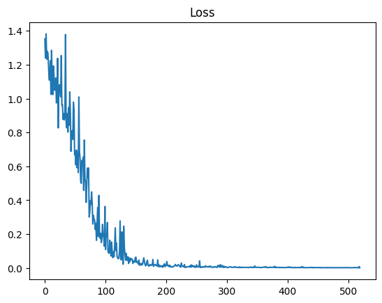
    


## Then Predict the outcome.
- Prediction should converge to the Ground Truth (Target)
<br>
Prediction = [ <br>
           [  [0,0,1,0],  [0,0,1,0], [0,0,1,0]  ], # Any data that has close to 1, has a probably of [0,0,1,0] <br>
           [  [1,0,0,0],  [1,0,0,0], [1,0,0,0]  ], # Any data that has close to 2, has a probably of [1,0,0,0]<br>
           [  [0,0,0,1],  [0,0,0,1], [0,0,0,1]  ], # Any data that has close to 3, has a probably of [0,0,0,1]<br>
           [  [1,0,0,0],  [1,0,0,0], [1,0,0,0] ],  # Any data that has close to 4, has a probably of [1,0,0,0]<br>
           [  [0,0,1,0],  [0,0,1,0], [0,0,1,0]  ]  # Any data that has close to 4, has a probably of [0,0,1,0]<br>
         ];


```python
yy_pred = modelgraph.predict() 
print(np.round(yy_pred,3));
```

    Entering Prediction Float ... ... Elapsed 96us at Tue Feb  4 17:00:53 2025
    
    [[[0.    0.    1.    0.   ]
      [0.    0.    1.    0.   ]
      [0.    0.    1.    0.   ]]
    
     [[0.997 0.    0.003 0.   ]
      [0.997 0.    0.003 0.   ]
      [0.997 0.    0.003 0.   ]]
    
     [[0.    0.    0.002 0.997]
      [0.    0.    0.002 0.997]
      [0.    0.    0.002 0.997]]
    
     [[0.999 0.    0.001 0.   ]
      [0.999 0.    0.001 0.   ]
      [0.999 0.    0.001 0.   ]]
    
     [[0.    0.    1.    0.   ]
      [0.    0.    0.998 0.002]
      [0.    0.    1.    0.   ]]]


# On Transformers  (Sequencing)
## About Encoder and Decoder


```python
import genai as ai
import numpy as np

#class MyModel(ai.Model):
#
#   def __init__(self, learningRate, datatype):
#     super().__init__(learningRate, datatype);

sample = ai.SampleClass(0.01);

modelgraph = ai.Model(dtype=ai.DataType.float32);

node1  = modelgraph.addNode("node1", ai.NodeType.Input);
#node1.setOperations([ ai.Dense(size=5), ai.Activation(type="leakyrelu", alpha=0.01) ]);
node1.setOperations([ai.Encoder(heads=2, attention_size=6, feed_size=4, layers=1, bias=True, activation_type="leakyrelu", alpha=0.01)]);
#node1.setOperations([ai.FeedForward(size=2, bias=True, type="leakyrelu", alpha=0.01)]);
#node1.setOperations([ai.Attention(size=5, bias=False, masked=False), ai.Activation(type="leakyrelu", alpha=0.01)]);
#node1.setOperations([ai.Dense(size=2, bias=True), ai.LayerNorm(), ai.Activation(type="leakyrelu", alpha=0.01)]);

# MANY_TO_MANY
#node1.setOperations([ai.RNN(hidden_size=6, output_size=5,  num_layers=1, bidirectional=True, rnntype=ai.RNNtype.MANY_TO_MANY), ai.Activation(type="gelu", alpha=0.01)]);
#node1.setOperations([ai.LSTM(hidden_size=6, output_size=5, num_layers=1, bidirectional=True, rnntype=ai.RNNtype.MANY_TO_MANY), ai.Activation(type="leakyrelu", alpha=0.01)]);
#node1.setOperations([ai.GRU(hidden_size=6, output_size=5, num_layers=1, bidirectional=True, rnntype=ai.RNNtype.MANY_TO_MANY), ai.Activation(type="leakyrelu", alpha=0.01)]);

# ONE_TO_MANY
#node1.setOperations([ai.RNN(hidden_size=6, output_size=5, output_sequence_length=3, num_layers=1, bidirectional=False, rnntype=ai.RNNtype.ONE_TO_MANY), ai.Activation(type="leakyrelu", alpha=0.01)]);
#node1.setOperations([ai.LSTM(hidden_size=6, output_size=5, output_sequence_length=3, num_layers=1, bidirectional=False, rnntype=ai.RNNtype.ONE_TO_MANY), ai.Activation(type="leakyrelu", alpha=0.01)]);
#node1.setOperations([ai.GRU(hidden_size=6, output_size=5, output_sequence_length=3, num_layers=1, bidirectional=False, rnntype=ai.RNNtype.ONE_TO_MANY), ai.Activation(type="leakyrelu", alpha=0.01)]);

node2  = modelgraph.addNode("node2", ai.NodeType.Input);
#node2.setOperations([ai.Dense(size=4, bias=True), ai.Activation(type="gelu", alpha=0.01)])
node2.setOperations([ai.Decoder(heads=2,  attention_size=6, feed_size=4, layers=1,  bias=True, activation_type="leakyrelu", alpha=0.01), 
                     ai.Dense(size=4, bias=True), ai.Activation(type="leakyrelu", alpha=0.01)]);

embedding1 = [
               [  [1.11,1.12,1.13,1.14],  [1.21,1.22,1.23,1.24], [1.31,1.32,1.33,1.34]  ], # sequence 1 of batch 1,2,3
               [  [2.11,2.12,2.13,2.14],  [2.21,2.22,2.23,2.24], [2.31,2.32,2.33,2.34]  ], # sequence 2 of batch 1,2,3
               [  [3.11,3.12,3.13,3.14],  [3.21,3.22,3.23,3.24], [3.31,3.32,3.33,3.34]  ], # sequence 3 of batch 1,2,3
               [  [4.11,4.12,4.13,4.14],  [4.21,4.22,4.23,3.24], [4.31,4.32,4.33,5.34]  ], # sequence 4 of batch 1,2,3
               [  [5.11,5.12,5.13,5.14],  [5.21,5.22,5.23,3.24], [5.31,5.32,5.33,5.34]  ]  # sequence 5 of batch 1,2,3
             ];

embedding2 = [
               [  [1.11,1.12,1.13,1.14],  [1.21,1.22,1.23,1.24], [1.31,1.32,1.33,1.34]  ], # sequence 1 of batch 1,2,3
               [  [2.11,2.12,2.13,2.14],  [2.21,2.22,2.23,2.24], [2.31,2.32,2.33,2.34]  ], # sequence 2 of batch 1,2,3
               [  [3.11,3.12,3.13,3.14],  [3.21,3.22,3.23,3.24], [3.31,3.32,3.33,3.34]  ], # sequence 3 of batch 1,2,3
               [  [4.11,4.12,4.13,4.14],  [4.21,4.22,4.23,3.24], [4.31,4.32,4.33,5.34]  ], # sequence 4 of batch 1,2,3
               [  [5.11,5.12,5.13,5.14],  [5.21,5.22,5.23,3.24], [5.31,5.32,5.33,5.34]  ]  # sequence 5 of batch 1,2,3
             ];

node1.setData(data = np.array(embedding1, dtype=np.float32), normalize=False);
node2.setDecoderData(data = np.array(embedding2, dtype=np.float32), normalize=False);

modelgraph.connect(node1, node2);

target = [
           [  [2.11,2.12,2.13,2.14],  [2.21,2.22,2.23,2.24], [2.31,2.32,2.33,2.34]  ], # sequence 1 of batch 1,2,3
           [  [3.11,3.12,3.13,3.14],  [3.21,3.22,3.23,3.24], [3.31,3.32,3.33,3.34]  ], # sequence 2 of batch 1,2,3
           [  [4.11,4.12,4.13,4.14],  [4.21,4.22,4.23,3.24], [4.31,4.32,4.33,5.34]  ], # sequence 3 of batch 1,2,3
           [  [5.11,5.12,5.13,5.14],  [5.21,5.22,5.23,3.24], [5.31,5.32,5.33,5.34]  ], # sequence 4 of batch 1,2,3
           [  [6.11,6.12,6.13,6.14],  [6.21,6.22,6.23,6.24], [6.31,6.32,6.33,6.34]  ]  # sequence 5 of batch 1,2,3
         ];

modelgraph.setTarget(data = np.array(target, dtype=np.float32));
loss = modelgraph.train(loss="mse", metrics=[], optimizer="adam", learn_rate=0.01, max_epoch=120);

ai.print_string("Done.", True)
```

     Set Decoder Data in float32 format ... 
    Fitting the model ...
    Target Size 5
    Batch Size: 10 Target Size: 5
    Epoch 1/120 ... Loss: 11.537 ... Avg Elapsed 581us at Tue Feb  4 17:20:14 2025
    
    Epoch 12/120 ... Loss: 0.287426 ... Avg Elapsed 389.909us at Tue Feb  4 17:20:14 2025
    
    Epoch 24/120 ... Loss: 0.234247 ... Avg Elapsed 580.75us at Tue Feb  4 17:20:14 2025
    
    Epoch 36/120 ... Loss: 0.12847 ... Avg Elapsed 485.083us at Tue Feb  4 17:20:14 2025
    
    Epoch 48/120 ... Loss: 0.125528 ... Avg Elapsed 471.333us at Tue Feb  4 17:20:14 2025
    
    Epoch 60/120 ... Loss: 0.12879 ... Avg Elapsed 413.833us at Tue Feb  4 17:20:14 2025
    
    Epoch 72/120 ... Loss: 0.135736 ... Avg Elapsed 451.917us at Tue Feb  4 17:20:14 2025
    
    Epoch 84/120 ... Loss: 0.124207 ... Avg Elapsed 420.833us at Tue Feb  4 17:20:14 2025
    
    Epoch 96/120 ... Loss: 0.0995543 ... Avg Elapsed 423.5us at Tue Feb  4 17:20:14 2025
    
    Epoch 108/120 ... Loss: 0.0917624 ... Avg Elapsed 492.083us at Tue Feb  4 17:20:14 2025
    
    Epoch 120/120 ... Loss: 0.0866805 ... Avg Elapsed 426.333us at Tue Feb  4 17:20:14 2025
    
     Duration D: 0, HR: 0, MN: 0, SC: 0.054858
    Done.


```python
import matplotlib.pylab as plt
plt.figure(1)
plt.title("Loss")
plt.plot(loss)
```


    [<matplotlib.lines.Line2D at 0x161a6fbd0>]


    
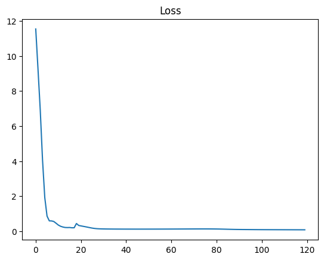
    


### Generate Dot Format for architecture diagram.


```python
dot_graph = modelgraph.generateDotFormat(operators=True, weights=True);
print(f"Parameters: ",  dot_graph.parameters);
```

    Parameters:  400


```python
from graphviz import Source
source = Source(dot_graph.dot, format='svg')

# Display the graph in the notebook
display(source)

```


    
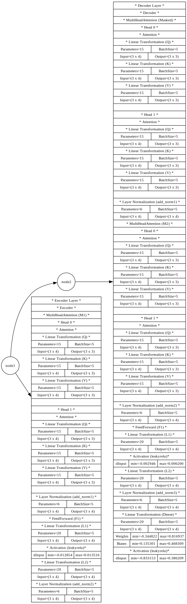
    


## On Convolution (Images)


```python
import genai as ai
import numpy as np
ai.print_string("Hello", True)

#class MyModel(ai.Model):
#
#   def __init__(self, learningRate, datatype):
#     super().__init__(learningRate, datatype);

modelgraph = ai.Model(dtype=ai.DataType.float32);

node1  = modelgraph.addNode("node1", ai.NodeType.Input);

node1.setOperations([ai.Convolution(kernel_size=2, stride=1, padding=1, dilation=1, bias=True), ai.BatchNorm(), ai.LayerNorm()]);

node2  = modelgraph.addNode("node2", ai.NodeType.Input);
node2.setOperations([ai.Convolution(kernel_size=2, stride=1, padding=1, dilation=1, bias=True),
                     ai.Flatten(),
                     ai.Dropout(probability = 0.05),
                     ai.Dense(size=4, bias=True),
                     ai.Activation(type="softmax", alpha=0.01)]);

embedding1 = [
               [  [1.11,8.12,1.13,5.14],  [1.21,1.22,1.23,13.24], [1.31,5.32,2.33,1.34]  ], # sequence 1 of batch 1,2,3
               [  [4.11,2.12,6.13,2.14],  [2.21,2.22,2.23,2.24], [9.31,3.32,8.33,0.34]  ], # sequence 2 of batch 1,2,3
               [  [3.11,3.12,3.13,3.14],  [3.21,5.22,4.23,3.24], [0.31,3.32,3.33,3.34]  ], # sequence 3 of batch 1,2,3
               [  [4.11,2.12,8.13,4.14],  [4.21,4.22,9.23,8.24], [8.31,6.32,4.33,1.34]  ], # sequence 4 of batch 1,2,3
               [  [5.11,9.12,5.13,5.14],  [6.21,2.22,5.23,13.24], [1.31,5.32,5.33,12.34]  ]  # sequence 5 of batch 1,2,3
             ];

node1.setData(data = np.array(embedding1, dtype=np.float32), normalize=True);

modelgraph.connect(node1, node2);

target = [
           [  [1.00, 0.00, 0.00, 0.00 ]  ],
           [  [0.00, 1.00, 0.00, 0.00 ]  ],
           [  [0.00, 0.00, 1.00, 0.00 ]  ],
           [  [0.00, 0.00, 0.00, 1.00 ]  ],
           [  [1.00, 0.00, 0.00, 0.00 ]  ]
         ];
modelgraph.setTarget(data = np.array(target, dtype=np.float32), normalize=True);

# Using Cross-Entropy
loss = modelgraph.train(loss="cce", metrics=[], optimizer="adam", learn_rate=0.001, max_epoch=500);

ai.print_string("Show Graph ...", True);
dot_graph = modelgraph.generateDotFormat(operators=True, weights=False);
print(dot_graph);
ai.print_string("end show ...", True);


ai.print_string("Done.", True)
```

    Hello
    Fitting the model ...
    Target Size 5
    Batch Size: 10 Target Size: 5
    Epoch 1/500 ... Loss: 1.4196 ... Avg Elapsed 277us at Tue Feb  4 17:20:50 2025
    
    Epoch 50/500 ... Loss: 1.32502 ... Avg Elapsed 127.959us at Tue Feb  4 17:20:50 2025
    
    Epoch 100/500 ... Loss: 1.00281 ... Avg Elapsed 171.42us at Tue Feb  4 17:20:50 2025
    
    Epoch 150/500 ... Loss: 0.723035 ... Avg Elapsed 137.22us at Tue Feb  4 17:20:50 2025
    
    Epoch 200/500 ... Loss: 0.360576 ... Avg Elapsed 107.08us at Tue Feb  4 17:20:50 2025
    
    Epoch 250/500 ... Loss: 0.105482 ... Avg Elapsed 102.42us at Tue Feb  4 17:20:50 2025
    
    Epoch 300/500 ... Loss: 0.070783 ... Avg Elapsed 101.26us at Tue Feb  4 17:20:50 2025
    
    Epoch 350/500 ... Loss: 0.020684 ... Avg Elapsed 100.12us at Tue Feb  4 17:20:51 2025
    
    Epoch 400/500 ... Loss: 0.0130252 ... Avg Elapsed 98.42us at Tue Feb  4 17:20:51 2025
    
    Epoch 450/500 ... Loss: 0.0120182 ... Avg Elapsed 99.36us at Tue Feb  4 17:20:51 2025
    
    Epoch 500/500 ... Loss: 0.00455877 ... Avg Elapsed 104.12us at Tue Feb  4 17:20:51 2025
    
     Duration D: 0, HR: 0, MN: 0, SC: 0.057618
    Show Graph ...
    <genai.Topology object at 0x161f72130>
    end show ...
    Done.


```python
import matplotlib.pylab as plt
plt.figure(1)
plt.title("Loss")
plt.plot(loss)

```


    [<matplotlib.lines.Line2D at 0x162295310>]


    
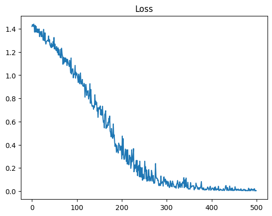
    


```python

```
